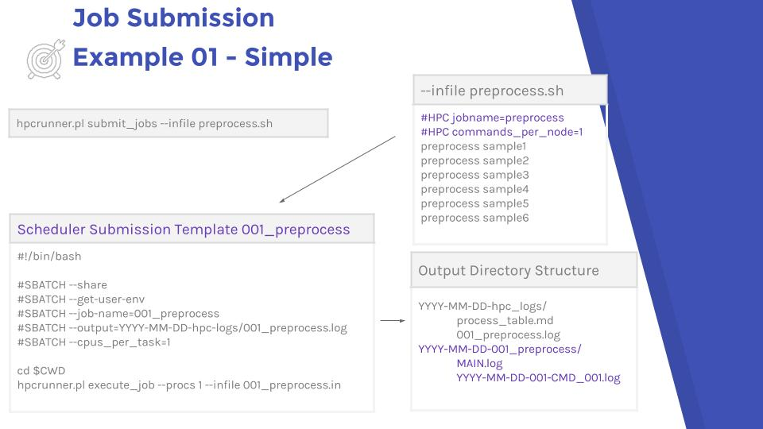

# Example 01 - Simple

The simplest example is one job type, where each task has a single thread.

```
#Filename - preprocess.sh
#HPC jobname=preprocess
#HPC commands_per_node=1
```

Here is a birds eye view of a simple example.

### Submission and output directory structure




### Job execution


## Examine the output

You can examine the [Full Jupyterhub Notebook](https://biosails.gitbooks.io/hpc-runner-command-docs/content/examples/example_01_jupyterhub.html) notebook here, and it is included below.


## HPC Runner Submission

### Submission file


```python
%%bash

cat example_001/preprocess.sh
```

    #HPC jobname=preprocess
    #HPC commands_per_node=1
    #HPC walltime=00:00:30
    #HPC module=gencore/1 gencore_dev
    echo "preprocess sample1" && sleep 30 
    echo "preprocess sample2" && sleep 30 
    echo "preprocess sample3" && sleep 30
    echo "preprocess sample4" && sleep 30
    echo "preprocess sample5" && sleep 30
    echo "preprocess sample6" && sleep 30


### Submit to Slurm

```
hpcrunner.pl submit_jobs --infile preprocess.sh
```

```
[2016/11/03 08:50:03] Beginning to submit jobs to the scheduler 
[2016/11/03 08:50:03] Schedule is preprocess 
[2016/11/03 08:50:03] Submitting all preprocess job types 
[2016/11/03 08:50:04] Submitted batch job 23162
 
[2016/11/03 08:50:04] Submited job /scratch/gencore/nov_dalma_training/example_001/hpc-runner/scratch/001_preprocess.sh
        With Slurm jobid 23162 
[2016/11/03 08:50:04] There are 6 batches for job type preprocess 
```

## Directory Structure


```python
%%bash

tree example_001
```

    example_001
    ├── hpc-runner
    │   ├── logs
    │   │   ├── 2016-11-03-001_preprocess
    │   │   │   ├── 2016-11-03-CMD_001-PID_13774.md
    │   │   │   ├── 2016-11-03-CMD_002-PID_13778.md
    │   │   │   ├── 2016-11-03-CMD_003-PID_13776.md
    │   │   │   ├── 2016-11-03-CMD_004-PID_16555.md
    │   │   │   ├── 2016-11-03-CMD_005-PID_16553.md
    │   │   │   ├── 2016-11-03-CMD_006-PID_16551.md
    │   │   │   └── MAIN_2016-11-03.log
    │   │   └── 2016-11-03-hpcrunner_logs
    │   │       ├── 001_preprocess.log
    │   │       └── 001-process_table.md
    │   └── scratch
    │       ├── 001_preprocess_001.in
    │       ├── 001_preprocess_002.in
    │       ├── 001_preprocess_003.in
    │       ├── 001_preprocess_004.in
    │       ├── 001_preprocess_005.in
    │       ├── 001_preprocess_006.in
    │       └── 001_preprocess.sh
    └── preprocess.sh
    
    5 directories, 17 files


## Task Log Output

Each individual task gets its own output file. The structure is date of submission, jobtype, date of executition, task count, and processID.


```python
%%bash

cat example_001/hpc-runner/logs/2016-11-03-001_preprocess/2016-11-03-CMD_001-PID_13774.md
```

    2016/11/03 08:50:11: INFO Starting Job: 1 
    Cmd is echo "preprocess sample1" && sleep 30 
     2016/11/03 08:50:11: INFO preprocess sample1
     2016/11/03 08:50:41: INFO Finishing job 1 with ExitCode 0
     2016/11/03 08:50:41: INFO Total execution time 0 years, 00 months, 0 days, 00 hours, 00 minutes, 30 seconds
     

## Slurm Log Output

Additionally, all output from the scheduler is logged. This is useful when debugging submissions. If, for instance, we had mistyped a module name, submitted to the wrong queue, or requested impossible resources, this would be recorded here.


```python
%%bash

cat example_001/hpc-runner/logs/2016-11-03-hpcrunner_logs/001_preprocess.log
```

    Module 'gencore/1' is already loaded
    Module 'gencore/1' is already loaded
    Module 'gencore/1' is already loaded
    Module 'gencore/1' is already loadedModule 'gencore/1' is already loadedModule 'gencore/1' is already loaded

## Process Table Output

The process table is a table for the whole job. It records version ( more on this later), the Slurm scheduler ID, the Slurm jobname, any task tags, and process pid, the exit code and the duration.

It is highly recommended to record this table in a project management tool.


```python
%%bash

ls example_001/hpc-runner/logs/2016-11-03-hpcrunner_logs/001-process_table.md
```

    example_001/hpc-runner/logs/2016-11-03-hpcrunner_logs/001-process_table.md


|Version | Scheduler Id | Jobname | Task Tags | ProcessID | ExitCode | Duration |
| ---     | ---         | ---      | ---       |  ---     | ---      | --- |
|0.0|23162|001_preprocess||16551|0|0 years, 00 months, 0 days, 00 hours, 00 minutes, 30 seconds|
|0.0|23167|001_preprocess||16553|0|0 years, 00 months, 0 days, 00 hours, 00 minutes, 30 seconds|
|0.0|23163|001_preprocess||13774|0|0 years, 00 months, 0 days, 00 hours, 00 minutes, 30 seconds|
|0.0|23166|001_preprocess||16555|0|0 years, 00 months, 0 days, 00 hours, 00 minutes, 30 seconds|
|0.0|23165|001_preprocess||13776|0|0 years, 00 months, 0 days, 00 hours, 00 minutes, 30 seconds|
|0.0|23164|001_preprocess||13778|0|0 years, 00 months, 0 days, 00 hours, 00 minutes, 30 seconds|
